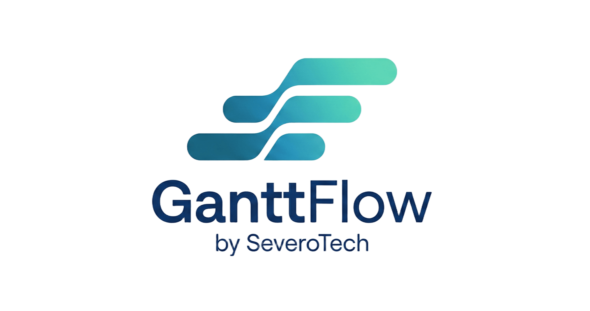

# GanttFlow

<!-- Logo placeholder -->
<!-- <p align="center">
  
</p> -->

<p align="center">
  
  
  
  
  
  
</p>

<p align="center">
  A full-featured, multi-tenant Gantt chart project management app with hierarchical task planning, live drag-and-drop scheduling, real-time collaboration, version snapshots, and fully customizable workspace settings.
</p>

---

## Table of Contents

- [Features](#features)
- [Tech Stack](#tech-stack)
- [Project Structure](#project-structure)
- [Getting Started](#getting-started)
  - [Prerequisites](#prerequisites)
  - [Installation](#installation)
- [Environment Variables](#environment-variables)
- [Available Scripts](#available-scripts)
- [API Reference](#api-reference)
- [Architecture Overview](#architecture-overview)
- [Contributing](#contributing)
- [License](#license)

---

## Features

### Gantt Chart

- Hierarchical three-level task tree: **Epic → Feature → Task**
- Live drag-and-drop bar repositioning constrained to the horizontal axis
- Timeline scale toggles: **Day, Week, Month, Quarter**
- Today marker with pulse animation and jump-to-today button
- Weekend column shading for at-a-glance week orientation
- Overdue bar highlight when a task is past its planned end date and not in a final status
- Scroll synchronization between the task panel and timeline viewport
- Expand and collapse Epic and Feature rows to control chart density

### Task and Item Management

- Inline item name editing directly on the Gantt row
- Inline status dropdown per row, driven by workspace-configured statuses
- Inline percentage completion editor with click-to-edit behavior
- Delay badge showing the number of days a task is behind schedule
- Add Epic, Feature, and Task items via a guided dialog
- Date rollup: task dates automatically propagate up to Features and Epics

### Project Management

- Project grid view listing all workspace projects with search
- Create, archive, and delete projects
- Collapsible sidebar with favorites section and workspace navigation

### Version Control

- Save named project snapshots at any point in time
- Browse and restore any previously saved version through the version picker
- Snapshot data stored independently — the live project is never overwritten

### Authentication & Security

- **NextAuth v5** with credentials and Google OAuth providers
- Email verification required before accessing the app
- **MFA via email OTP** enforced after credentials login
- Trusted device tokens — skip MFA for 30 days on recognized devices
- Rate limiting on auth endpoints (in-memory sliding window)
- Password hashing with bcrypt (12 rounds)

### Multi-Tenancy & Team Management

- **Account-scoped workspaces** — every project and setting is isolated per account
- Member roles: `owner`, `admin`, `member`
- Email-based team invitations with 30-day expiry tokens
- Plan-based member limits (enforced via Stripe billing)

### Workspace Settings

- Custom status configurations with hex colors and labels
- Mark statuses as "final" to prevent delayed-bar highlighting on completed items
- Configurable level names (rename Epic / Feature / Task to match your workflow)
- Default owner assignment for newly created items
- Dark and light theme toggle applied globally

### Internationalization

- **Three locales**: English (`en`), Brazilian Portuguese (`pt-BR`), Spanish (`es`)
- Cookie-based locale preference (no URL prefix)
- Locale stored on the user profile and carried in the JWT

### Billing

- Stripe subscription management
- Plan-based member limits (Starter: 5, Pro: 20)
- Trial period with auto-cancel

---

## Tech Stack

| Layer | Technology |
|---|---|
| Framework | Next.js 16 (App Router) |
| Language | TypeScript 5 |
| Styling | Tailwind CSS, shadcn/ui |
| State Management | Zustand with immer middleware |
| Drag and Drop | @dnd-kit/core |
| Database | MongoDB via Mongoose |
| Auth | NextAuth v5 (JWT strategy) |
| Email | Resend + Nodemailer |
| Payments | Stripe |
| i18n | next-intl v4 |
| Date Utilities | date-fns |
| Runtime | Node.js 18+ |

---

## Project Structure

```
/
├── src/
│   ├── app/
│   │   ├── api/
│   │   │   ├── auth/               # NextAuth handlers
│   │   │   ├── projects/           # CRUD + versions + changelog
│   │   │   ├── account/            # Account, members, invitations
│   │   │   ├── settings/           # Workspace + user settings
│   │   │   └── billing/            # Stripe subscription
│   │   ├── (auth)/                 # login, register, verify-email, mfa pages
│   │   ├── projects/
│   │   │   ├── page.tsx            # Project grid view
│   │   │   └── [id]/page.tsx       # Gantt chart view
│   │   ├── settings/page.tsx       # Workspace settings
│   │   └── layout.tsx              # Root layout with providers
│   ├── components/
│   │   ├── dialogs/                # NewProject, AddItem, SaveVersion, etc.
│   │   ├── gantt/                  # GanttBoard, GanttBar, GanttTimeline, GanttTaskPanel
│   │   ├── layout/                 # Sidebar, TopNav
│   │   ├── providers/              # AuthProvider, ThemeProvider
│   │   ├── settings/               # Settings section components
│   │   ├── shared/                 # StatusBadge, OwnerAvatar, ItemDetailDrawer
│   │   └── ui/                     # shadcn/ui primitives
│   ├── hooks/                      # useAccountRole, etc.
│   ├── i18n/
│   │   └── request.ts              # Locale resolution (cookie → header → default)
│   ├── lib/
│   │   ├── mongodb.ts              # Singleton Mongoose connection
│   │   ├── dateUtils.ts            # Rollup, bar style, column helpers
│   │   ├── apiAuth.ts              # requireAuth(), requireManage()
│   │   ├── email.ts                # Resend + Nodemailer transports
│   │   ├── rateLimit.ts            # In-memory sliding window
│   │   ├── seedWorkspace.ts        # Account + settings seeding on first login
│   │   ├── utils.ts                # cn() helper
│   │   └── models/                 # Mongoose models (User, Account, Project, …)
│   ├── store/
│   │   ├── useProjectStore.ts      # Gantt CRUD, drag, versions, persist
│   │   ├── useSettingsStore.ts     # Workspace settings
│   │   ├── useAccountStore.ts      # Account, members, invitations
│   │   └── usePresenceStore.ts     # Real-time cursors and connected users
│   └── types/
│       └── index.ts                # All TypeScript interfaces and type aliases
├── messages/
│   ├── en.json
│   ├── pt-BR.json
│   └── es.json
└── public/                         # Static assets
```

---

## Getting Started

### Prerequisites

- **Node.js** 18 or higher
- **pnpm** 9 or higher
- A running **MongoDB** instance (local or hosted, e.g., MongoDB Atlas)
- A **Resend** account for transactional email
- (Optional) **Google OAuth** credentials for social login
- (Optional) **Stripe** account for billing

### Installation

1. Clone the repository.

   ```bash
   git clone https://github.com/your-username/ganttflow.git
   cd ganttflow
   ```

2. Install dependencies.

   ```bash
   pnpm install
   ```

3. Create a local environment file by copying the example.

   ```bash
   cp .env.example .env.local
   ```

4. Populate the required environment variables in `.env.local`. See [Environment Variables](#environment-variables) below.

5. Start the development server.

   ```bash
   pnpm run dev
   ```

6. Open [http://localhost:3000](http://localhost:3000) in your browser.

---

## Environment Variables

Create a `.env.local` file in the project root.

| Variable | Required | Description |
|---|---|---|
| `AUTH_SECRET` | Yes | Secret for NextAuth session signing |
| `NEXTAUTH_URL` | Yes | Public base URL, e.g. `http://localhost:3000` |
| `MONGODB_URI` | Yes | MongoDB connection string |
| `RESEND_API_KEY` | Yes | Resend API key for transactional email |
| `EMAIL_FROM` | Yes | Sender address, e.g. `GanttFlow <noreply@example.com>` |
| `GOOGLE_CLIENT_ID` | No | Google OAuth client ID |
| `GOOGLE_CLIENT_SECRET` | No | Google OAuth client secret |
| `STRIPE_SECRET_KEY` | No | Stripe secret key for billing |
| `STRIPE_WEBHOOK_SECRET` | No | Stripe webhook signing secret |
| `NEXT_PUBLIC_STRIPE_PUBLISHABLE_KEY` | No | Stripe publishable key (client-side) |

**Minimal `.env.local` for local development:**

```env
AUTH_SECRET=change-me-to-a-random-string
NEXTAUTH_URL=http://localhost:3000
MONGODB_URI=mongodb://localhost:27017/ganttflow
RESEND_API_KEY=re_xxxxxxxxxxxx
EMAIL_FROM=GanttFlow <noreply@localhost>
```

> **Security:** Never commit `.env.local` or any file containing secrets to version control.

---

## Available Scripts

| Script | Command | Description |
|---|---|---|
| Development | `pnpm run dev` | Start the Next.js development server at port 3000 |
| Build | `pnpm run build` | Type-check and compile for production |
| Start | `pnpm run start` | Run the production build |
| Lint | `pnpm run lint` | Run ESLint across all source files |
| Type Check | `pnpm exec tsc --noEmit` | Check types without emitting files |

---

## API Reference

All routes are Next.js App Router API routes under `src/app/api/`. Every route requires a valid session (via `requireAuth()`). Admin-only routes additionally require `owner` or `admin` role (via `requireManage()`).

### Projects

| Method | Path | Description |
|---|---|---|
| `GET` | `/api/projects` | List all projects in the account |
| `POST` | `/api/projects` | Create a new project |
| `GET` | `/api/projects/[id]` | Get a project with its full Epic → Feature → Task tree |
| `PATCH` | `/api/projects/[id]` | Update project fields or the task tree |
| `DELETE` | `/api/projects/[id]` | Delete a project and all its snapshots |

### Versions

| Method | Path | Description |
|---|---|---|
| `GET` | `/api/projects/[id]/versions` | List all saved snapshots |
| `POST` | `/api/projects/[id]/versions` | Save a new named snapshot |
| `GET` | `/api/projects/[id]/versions/[versionId]` | Get a snapshot for restore |

### Settings

| Method | Path | Description |
|---|---|---|
| `GET` | `/api/settings` | Get workspace + user settings |
| `PATCH` | `/api/settings` | Update settings (managed fields require admin) |

### Account & Members

| Method | Path | Description |
|---|---|---|
| `GET` | `/api/account` | Get current account info |
| `GET` | `/api/account/members` | List all members |
| `PATCH` | `/api/account/members/[userId]` | Update a member's role |
| `DELETE` | `/api/account/members/[userId]` | Remove a member |
| `POST` | `/api/account/invitations` | Invite a new member by email |
| `DELETE` | `/api/account/invitations/[id]` | Cancel a pending invitation |

### Response Format

All endpoints return `application/json`. Errors return `{ error: string, code?: string }` with the appropriate HTTP status code. The `code` field maps to an i18n key in the `apiErrors` namespace.

---

## Architecture Overview

### Multi-Tenancy

Every object (project, settings, member) is scoped to an `accountId`. On first login, `seedAccountForNewUser()` creates a default `Account` and `WorkspaceSettings`. Users belong to exactly one account and carry their `accountId` in the JWT.

### State Management

GanttFlow uses Zustand stores with immer middleware:

- **`useProjectStore`** — active project, full Epic → Feature → Task tree, drag state, versions. Every mutation triggers date rollup and debounced `PATCH /api/projects/[id]`.
- **`useSettingsStore`** — workspace statuses, level names, theme, locale.
- **`useAccountStore`** — account info, members, invitations, billing.
- **`usePresenceStore`** — real-time cursor positions and connected users.

### Data Flow

```
User interaction (drag, edit, status change)
        │
        ▼
Zustand store action
        │
        ▼
immer draft mutation + date rollup (dateUtils.ts)
        │
        ▼
PATCH /api/projects/[id]  ──►  MongoDB (Mongoose)
```

### Timeline Rendering

Dates are converted to pixel positions using `pxPerDay`, which varies by scale:

| Scale | pxPerDay |
|---|---|
| Day | 40 |
| Week | 28 |
| Month | 10 |
| Quarter | 4 |

On drag end, `delta.x / pxPerDay` → `deltaDays` → `addDays(plannedStart/End)`. Dragging an Epic shifts all descendant Features and Tasks.

---

## Contributing

1. Fork the repository and create a branch from `main`.

   ```bash
   git checkout -b feat/your-feature-name
   ```

2. Make your changes following the patterns in `CLAUDE.md`.

3. Verify the build and types pass.

   ```bash
   pnpm run build && pnpm run lint
   ```

4. Commit with a [Conventional Commits](https://www.conventionalcommits.org/) message.

   ```bash
   git commit -m "feat: add resource allocation view"
   ```

5. Push and open a pull request against `main`.

### Code Style Guidelines

- All components must be written in TypeScript with explicit prop types.
- Use `cn()` from `src/lib/utils.ts` for conditional class names; no inline styles except dynamic colors.
- All state mutations go through the Zustand store.
- New API routes must follow the auth guard + try/catch pattern in `CLAUDE.md`.
- Every user-facing string must have an entry in all three `messages/*.json` files.
- Use `pnpm` — never `npm` or `yarn`.

---

## License

This project is licensed under the MIT License.

```
MIT License

Copyright (c) 2026 GanttFlow Contributors

Permission is hereby granted, free of charge, to any person obtaining a copy
of this software and associated documentation files (the "Software"), to deal
in the Software without restriction, including without limitation the rights
to use, copy, modify, merge, publish, distribute, sublicense, and/or sell
copies of the Software, and to permit persons to whom the Software is
furnished to do so, subject to the following conditions:

The above copyright notice and this permission notice shall be included in all
copies or substantial portions of the Software.

THE SOFTWARE IS PROVIDED "AS IS", WITHOUT WARRANTY OF ANY KIND, EXPRESS OR
IMPLIED, INCLUDING BUT NOT LIMITED TO THE WARRANTIES OF MERCHANTABILITY,
FITNESS FOR A PARTICULAR PURPOSE AND NONINFRINGEMENT. IN NO EVENT SHALL THE
AUTHORS OR COPYRIGHT HOLDERS BE LIABLE FOR ANY CLAIM, DAMAGES OR OTHER
LIABILITY, WHETHER IN AN ACTION OF CONTRACT, TORT OR OTHERWISE, ARISING FROM,
OUT OF OR IN CONNECTION WITH THE SOFTWARE OR THE USE OR OTHER DEALINGS IN THE
SOFTWARE.
```
